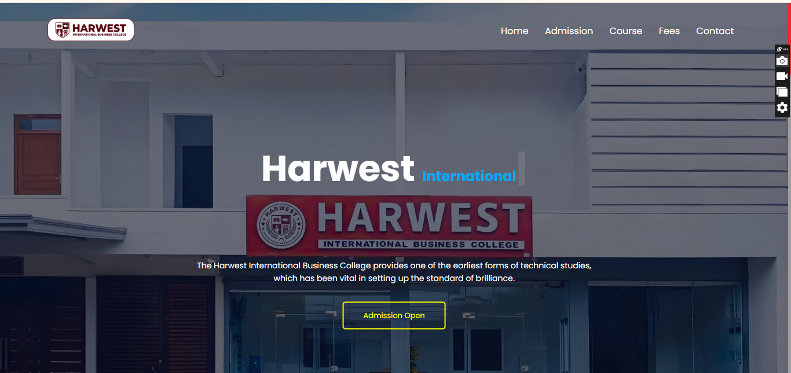

# 🎓 Harwest International Business College – Website  

Welcome to the **Harwest International Business College** website project.  
This platform showcases the institution, its courses, admission process, and fees in a modern and professional design.  

---

## ✨ Features  

- 🏫 **Home Page** – Attractive landing page with college introduction  
- 📝 **Admission Section** – Information on how to apply and admission updates  
- 📚 **Course Details** – Overview of programs offered by the college  
- 💰 **Fees Structure** – Transparent details about tuition and other charges  
- 📞 **Contact Page** – Easy way for students and parents to reach the college  

---

## 🖼️ Preview  

  

## 🔗 Live Demo  

👉 [Click here to view the live demo](https://hibc-college-website.netlify.app) 

---

## 🛠️ Technologies Used  

- **HTML5**  
- **CSS3**  
- **JavaScript**  
- **Responsive Design**  

---

## 🚀 How to Use  

1. Clone this repository:  
   ```bash
   https://github.com/Ifam0605/HIBC-College-Website.git
